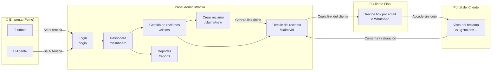
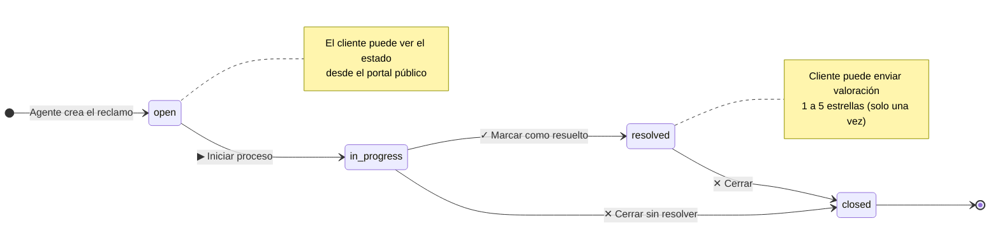
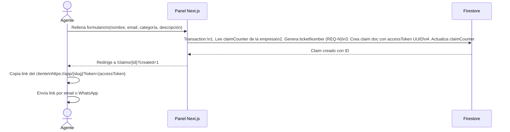
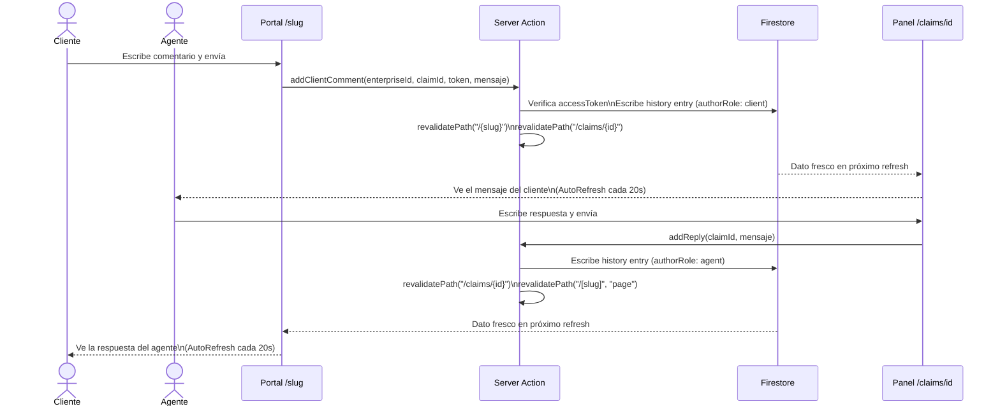
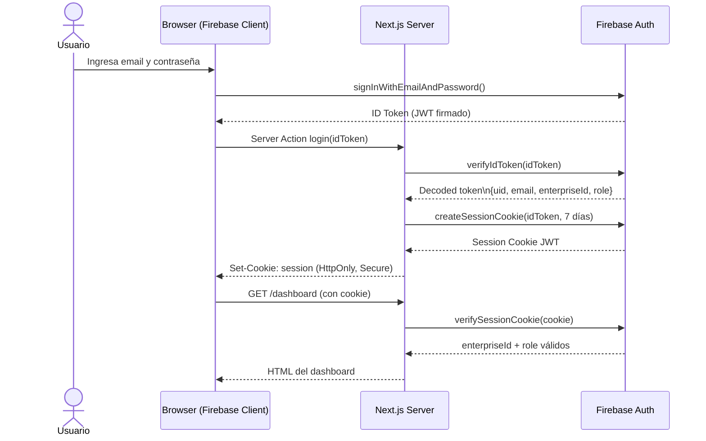
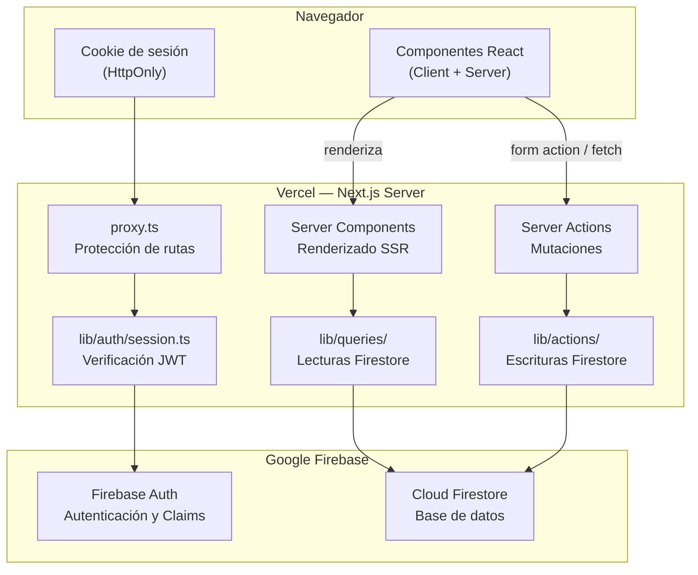

# Flujos del sistema — Reclama Pro

---

## 1. Flujo por rol de usuario

Reclama Pro tiene tres tipos de usuario con recorridos completamente distintos.

---

## 2. Ciclo de vida de un reclamo

Un reclamo sigue un flujo de estados definido. Los botones de acción del panel solo muestran los pasos válidos según el estado actual — no hay dropdown que permita saltar estados.

---

## 3. Flujo de creación de un reclamo

El reclamo siempre lo crea el agente o admin desde el panel. El cliente no puede crearlo directamente.

---

## 4. Flujo de comunicación agente ↔ cliente

Una vez creado el reclamo, agente y cliente pueden intercambiar mensajes. El historial es bidireccional y ambos ven las mismas entradas.

---

## 5. Flujo de autenticación

---

## 6. Arquitectura técnica por capas

