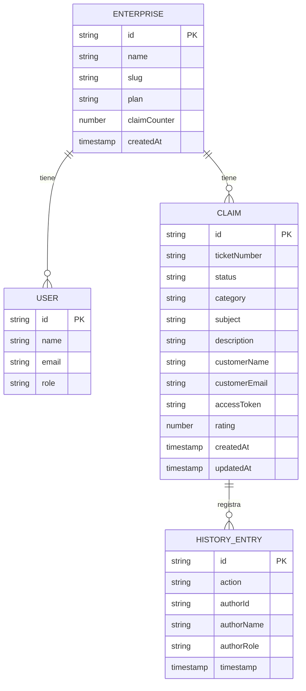

# Modelo de datos — Reclama Pro

Firestore con estructura de subcolecciones jerárquicas. Cada empresa tiene sus datos completamente aislados bajo su propio `enterpriseId`.

---

## Estructura de colecciones

```
enterprises/{enterpriseId}
│   name, slug, plan, createdAt, claimCounter
│
├── users/{userId}
│       name, email, role
│
└── claims/{claimId}
        ticketNumber, status, category, subject,
        description, customerName, customerEmail,
        accessToken, rating, createdAt, updatedAt
        │
        └── history/{entryId}
                action, authorId, authorName,
                authorRole, timestamp
```

---

## Diagrama de relaciones



---

## Colección `enterprises`

Documento raíz de cada empresa (tenant).

| Campo | Tipo | Descripción |
|---|---|---|
| `name` | `string` | Nombre comercial de la empresa |
| `slug` | `string` | Identificador en la URL del portal (`/techstore-chile?token=...`) |
| `plan` | `string` | Nivel de suscripción: `basic` · `pro` · `enterprise` |
| `claimCounter` | `number` | Contador atómico para tickets secuenciales. Inicia en `0` |
| `createdAt` | `Timestamp` | Fecha de registro |

---

## Subcolección `users`

Empleados de la empresa con acceso al panel administrativo.

| Campo | Tipo | Descripción |
|---|---|---|
| `name` | `string` | Nombre completo |
| `email` | `string` | Correo (coincide con Firebase Auth) |
| `role` | `string` | `admin` — control total · `agent` — gestión de casos |

> El ID del documento en esta subcolección coincide con el `uid` de Firebase Auth.

---

## Subcolección `claims`

Un documento por cada reclamo. Creado exclusivamente por el agente desde el panel.

| Campo | Tipo | Descripción |
|---|---|---|
| `ticketNumber` | `string` | Código legible secuencial por empresa (`REC-00001`) |
| `status` | `string` | `open` · `in_progress` · `resolved` · `closed` |
| `category` | `string` | Key de categoría fija (ver tabla más abajo) |
| `subject` | `string` | Asunto corto del reclamo |
| `description` | `string` | Detalle completo |
| `customerName` | `string` | Nombre del cliente |
| `customerEmail` | `string` | Email del cliente (para notificaciones futuras) |
| `accessToken` | `string` | UUID que permite al cliente acceder al portal sin login |
| `rating` | `number \| null` | Valoración 1–5. `null` hasta que el cliente la envíe. Solo editable una vez |
| `createdAt` | `Timestamp` | Fecha de creación |
| `updatedAt` | `Timestamp` | Última modificación de estado |

### Categorías disponibles

| Key (almacenada en Firestore) | Label mostrado en UI |
|---|---|
| `defective_product` | Producto defectuoso |
| `delivery_delay` | Retraso en entrega |
| `poor_service` | Mal servicio al cliente |
| `billing_error` | Error en cobro / facturación |
| `warranty` | Garantía |
| `other` | Otro |

### Estados y transiciones

```
open  ──▶  in_progress  ──▶  resolved  ──▶  closed
                        └──▶  closed
```

Los botones del panel solo muestran los pasos siguientes válidos. No existe un dropdown con todos los estados.

---

## Subcolección `history`

Log de auditoría y comunicación de cada reclamo.

| Campo | Tipo | Descripción |
|---|---|---|
| `action` | `string` | Texto del mensaje o descripción del evento |
| `authorId` | `string` | UID del agente, o `"client"` para el cliente |
| `authorName` | `string` | Nombre del autor (del doc en `users/` o del claim) |
| `authorRole` | `string` | `"agent"` · `"client"` |
| `timestamp` | `Timestamp` | Fecha y hora del evento |

---

## Notas de implementación

### Ticket secuencial con Transaction

El número de ticket se genera dentro de una Firestore Transaction para garantizar que no haya duplicados bajo carga concurrente:

```
1. Lee enterprise doc → obtiene claimCounter actual
2. ticketNumber = `REC-${String(counter + 1).padStart(5, '0')}`
3. Escribe el nuevo claim doc con ese ticketNumber
4. Actualiza enterprise.claimCounter += 1
Todo en la misma transacción — si falla algún paso, todo se revierte.
```

### Rating — una sola valoración

La protección está en el servidor, no en el cliente:

```
1. Lee claim doc
2. Si rating !== null → rechaza (el cliente ya valoró)
3. Si rating === null Y status es resolved o closed → actualiza
```

### Reportes — sin colecciones extra

Los KPIs del dashboard y los reportes se generan consultando `claims` con filtros de fecha. La agregación por categoría y el rating promedio se calculan en JavaScript en el BFF — sin colecciones `reports/` separadas.

---

## Fuera del MVP

- Notificaciones por email al cliente (el campo `customerEmail` ya existe)
- Adjuntos o imágenes en reclamos
- Prioridad / urgencia de reclamo
- Cuentas de cliente (actualmente solo `accessToken`)
- Panel super-admin para múltiples empresas
